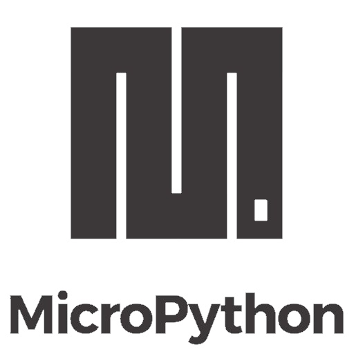
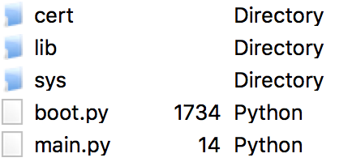

# 1.3.1 Introduction to MicroPython

Our boards work with [MicroPython](https://micropython.org/); a Python 3.5 implementation that is optimised to run on micro controllers. This allows for much faster and more simple development process than using C.

## Booting into MicroPython

When booting, two files are executed automatically: first `boot.py` and then `main.py`. These are placed in the `/flash` folder on the board. Any other files or libraries can be placed here as well, and can be included or used from `boot.py` or `main.py`.

The folder structure in `/flash` looks like the picture below. The files can be managed either using FTP or using the Pymakr Plugin.

## Tips & Tricks

Micropython shares majority of the same syntax as Python 3.5. The intention of this design is to provide compatibility upwards from Micropython to Python 3.5, meaning that code written for Micropython should work in a similar manner in Python 3.5. There are some minor variations and these should taken viewed as implementation differences.

Micropython also has a number of Micropython specific libraries for accessing hardware level features. Specifics relating to those libraries can be found in the Firmware API Reference section of this documentation.


Micropython, unlike C/C++ or Arduino, **does not use braces {} to indicate blocks of code** specified for class and function definitions or flow control. Blocks of code are denoted by line indentation, which is strictly enforced.

The number of spaces in the indentation is variable but all statements within a block must be indented the same amount.


