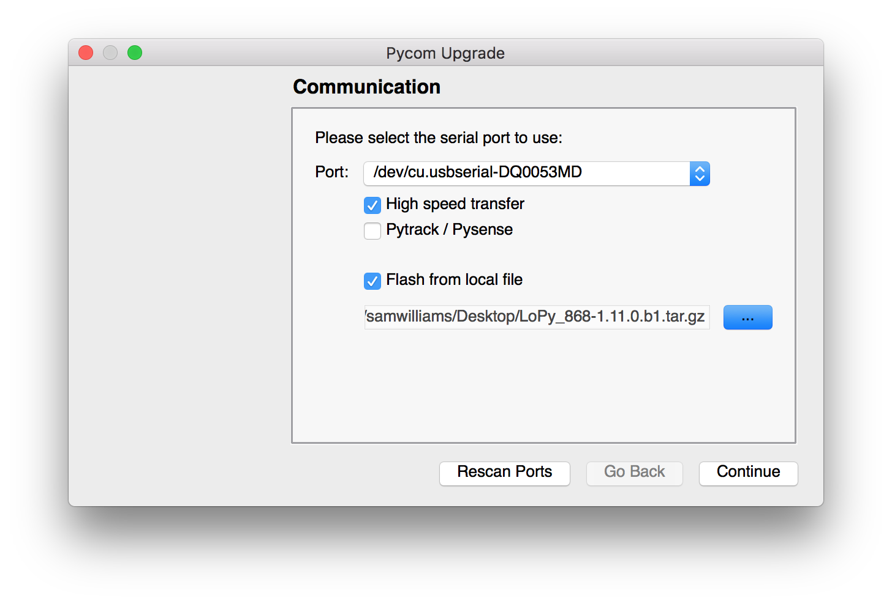

# 10.1 Firmware Downgrade

The firmware upgrade tool usually updates your device to the latest available firmware version. If you require to downgrade your device to a previous firmware there are two methods to achieve this.


If you are using an Expansion Board 1.0 or 2.0, you will need to have a jumper connected between `G23` and `GND` to use either procedure below. You will also need to press the reset button before beginning.


You can obtain previous firmware versions here:

* [WiPy](https://software.pycom.io/downloads/WiPy.html)
* [LoPy](https://software.pycom.io/downloads/LoPy.html)
* [SiPy](https://software.pycom.io/downloads/SiPy.html)
* [GPy](https://software.pycom.io/downloads/GPy.html)
* [FiPy](https://software.pycom.io/downloads/FiPy.html)
* [LoPy4](https://software.pycom.io/downloads/LoPy4.html)

**Note:** Prior to version `1.16.0.b1` the firmware for modules with LoRa functionality was frequency specific. From `1.16.0.b1` and onward, the firmware is region agnostic and this can either be set programatically or via the config block \(see [here](cli.md#lpwan)\).

## GUI

As of version `1.12.0.b0` of the firmware update tool, you can now provide a `.tar` or `.tar.gz` archive of the firmware you wish to upload to the board.

When you start the update tool you will see the following screen:



When you tick the `Flash from local file` option, an address bar will appear. Click the `...` button and locate the `.tar(.gz)` file with the firmware you wish to flash to your device. From this point the updater will behave just like a regular update but using the local file instead of downloading the latest.

## Command line

You can also use the [CLI](cli.md) version of the update tool to downgrade your device. Will need to get a `.tar` or `.tar.gz` archive of the firmware you wish to upload to the board. Then run the following commands:

```bash
$ pycom-fwtool-cli -v -p PORT flash -t /path/to/firmware/archive.tar.gz
```

