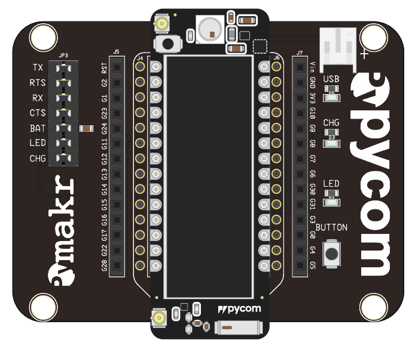
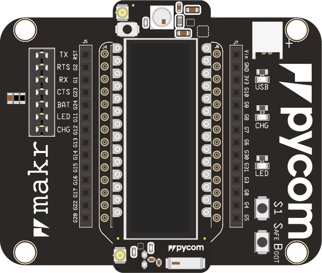
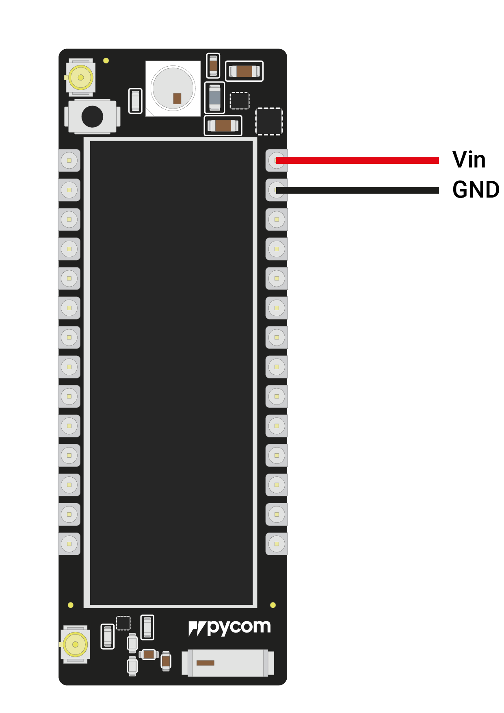
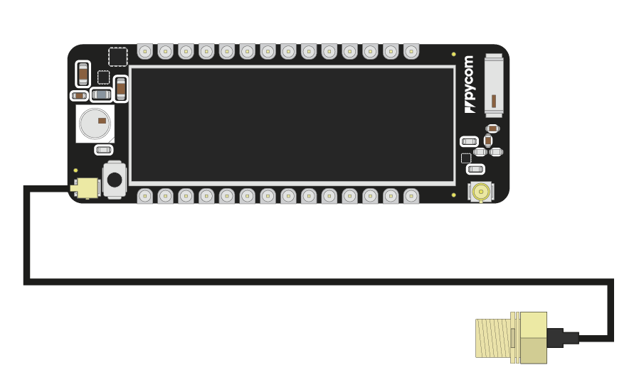
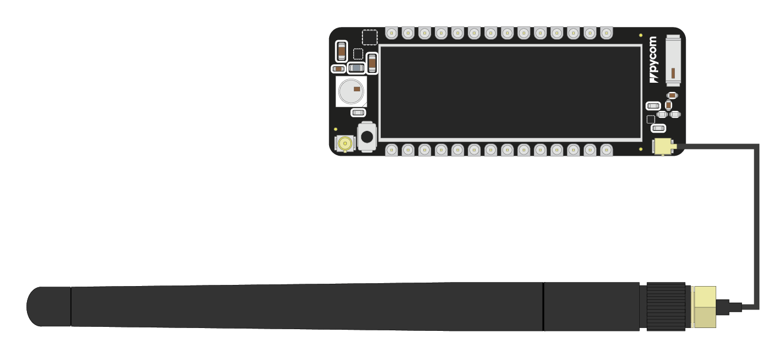

# FiPy

## Basic connection



* When using the expansion board with a FiPy, you will need to remove the CTS and RTS jumpers as these interfere with communication with the cellular modem.
* Look for the reset button on the module \(located at a corner of the board, next to the LED\).
* Locate the USB connector on the expansion board.
* Insert the FiPy module on the the expansion board with the reset button pointing towards the USB connector. It should firmly click into place and the pins should now no longer be visible.




* Before connecting your module to an Expansion Board 3.0, you should update the firmware on the Expansion Board 3.0. Instructions on how to do this can be found [here](../../pytrack-pysense-pyscan/installation/firmware.md).
* When using the expansion board with a FiPy, you will need to remove the CTS and RTS jumpers as these interfere with communication with the cellular modem.
* Look for the reset button on the module \(located at a corner of the board, next to the LED\).
* Locate the USB connector on the expansion board.
* Insert the FiPy module on the Expansion Board with the reset button pointing towards the USB connector. It should firmly click into place and the pins should now no longer be visible.




* Before connecting your module to a Pysense/Pytrack/Pyscan board, you should update the firmware on the Pysense/Pytrack/Pyscan. Instructions on how to do this can be found [here](../../pytrack-pysense-pyscan/installation/firmware.md).
* Look for the reset button on the FiPy module \(located at a corner of the board, next to the LED\).
* Locate the USB connector on the Pysense/Pytrack/Pyscan.
* Insert the module on the Pysense/Pytrack/Pyscan with the reset button pointing towards the USB connector. It should firmly click into place and the pins should now no longer be visible. 



* Firstly you will need to connect power to your FiPy. You will need to supply `3.5v`-`5.5v` to the `Vin` pin.


Do **not** feed `3.3v` directly to the `3.3v` supply pin, this will damage the regulator.


* The connect the `RX` and `TX` of your USB UART to the `TX` and `RX` of the FiPy respectively.


Please ensure you have the signal level of the UART adapter set to `3.3v` before connecting it.


* In order to put the FiPy into bootloader mode to update the device firmware you will need to connect `P2` to `GND`. We recommend you connect a button between the two to make this simpler.




**Note:** This method of connection is not recommended for first time users. It is possible to lock yourself out of the device, requiring a USB connection.

* In order to access the FiPy via WiFi you only need to provide `3.5v` - `5.5v` on the `Vin` pin of the FiPy:

* By default, when the FiPy boots, it will create a WiFi access point with the following credentials:
  * SSID: `fipy-wlan`
  * password: `www.pycom.io`
* Once connected to this network you will be able to access the telnet and FTP servers running on the FiPy. For both of these the login details are:
  * username: `micro`
  * password: `python`



## Antennas

### Lora/Sigfox


If you intend on using the LoRa/Sigfox connectivity of the FiPy you **must** connect a LoRa/Sigfox antenna to your FiPy before trying to use LoRa/Sigfox otherwise you risk damaging the device.



The FiPy only supports LoRa on the 868MHz or 915MHz bands. It does not support 433MHz. For this you will require a LoPy4.


* Firstly you will need to connect the U.FL to SMA pig tail to the FiPy using the U.FL connector on the same side of the FiPy as the LED.

* If you are using a pycase, you will next need to put the SMA connector through the antenna hole, ensuring you align the flat edge correctly, and screw down the connector using the provided nut.
* Finally you will need to screw on the antenna to the SMA connector.

### LTE Cat-M1/NB-IoT


If you intend on using the LTE CAT-M1 or NB-IoT connectivity of the FiPy you **must** connect a LTE CAT-M1/NB-IoT antenna to your FiPy before trying to use LTE Cat-M1 or NB-IoT otherwise you risk damaging the device.


* You will need to connect the antenna to the FiPy using the U.FL connector on the under side of the FiPy.

### WiFi/Bluetooth \(optional\)

All Pycom modules, including the FiPy, come with a on-board WiFi antenna as well as a U.FL connector for an external antenna. The external antenna is optional and only required if you need better performance or are mounting the FiPy in such a way that the WiFi signal is blocked. Switching between the antennas is done via software, instructions for this can be found [here.](../../firmware-and-api-reference/pycom/network/wlan.md)

### SIM card {#sim-card}

If you intend on using the LTE CAT-M1 or NB-IoT connectivity of the FiPy you will need to insert a SIM card into your FiPy. It should be noted that the FiPy does not support regular LTE connectivity and you may require a special SIM. It is best to contact your local cellular providers for more information on acquiring a LTE CAT-M1/NB-IoT enabled nano SIM.

