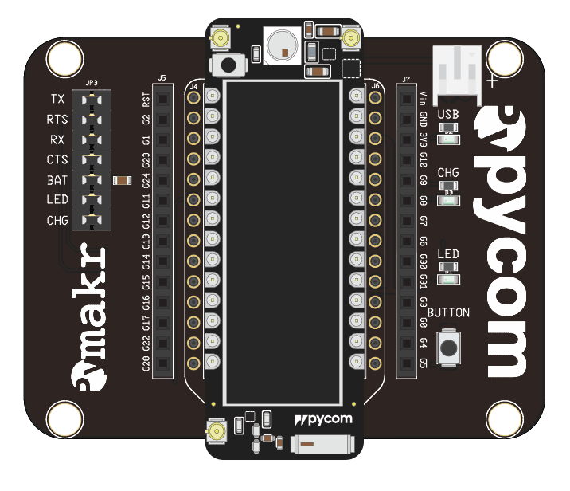
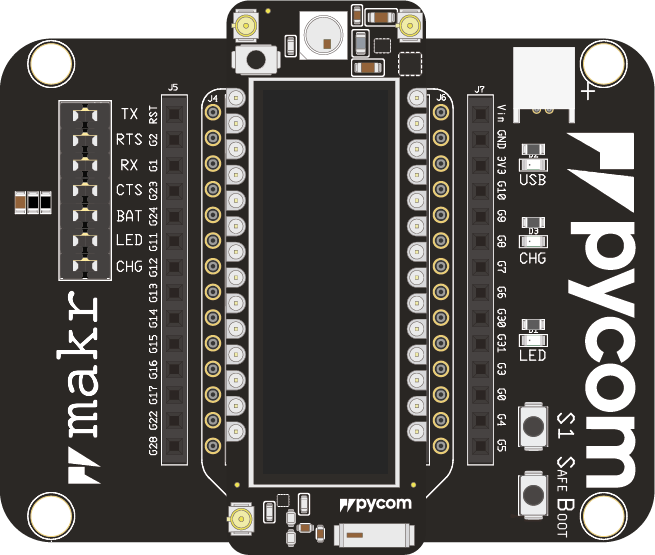
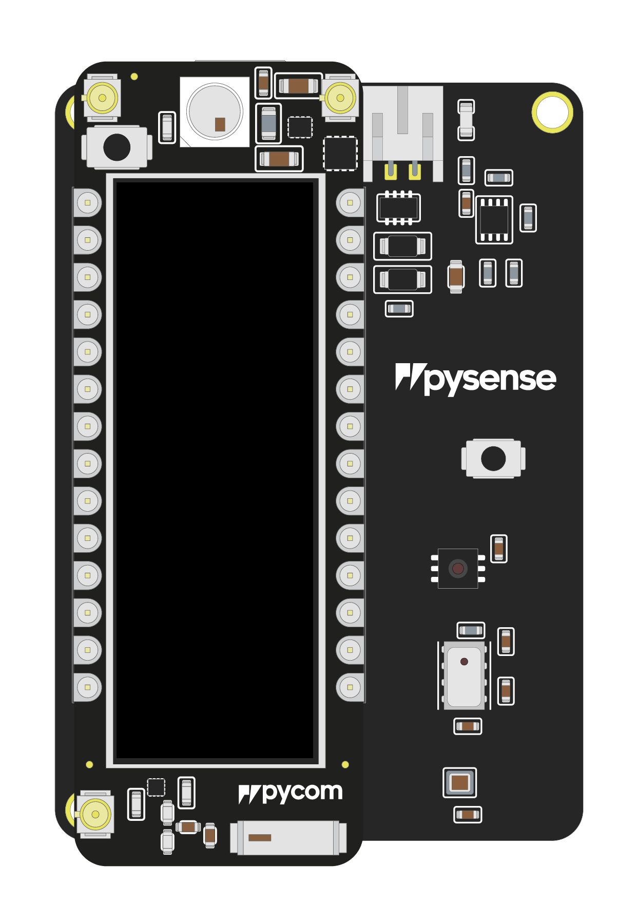
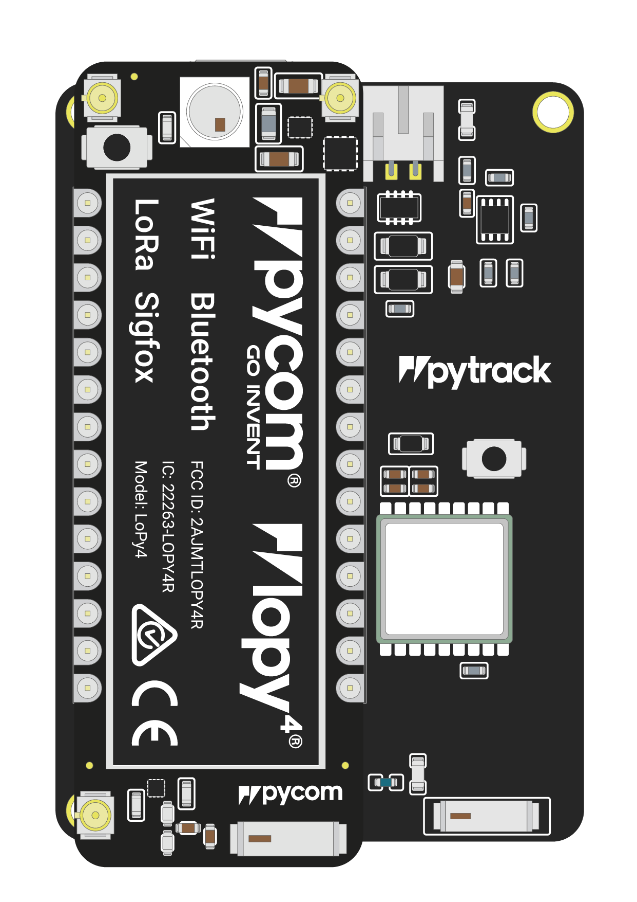
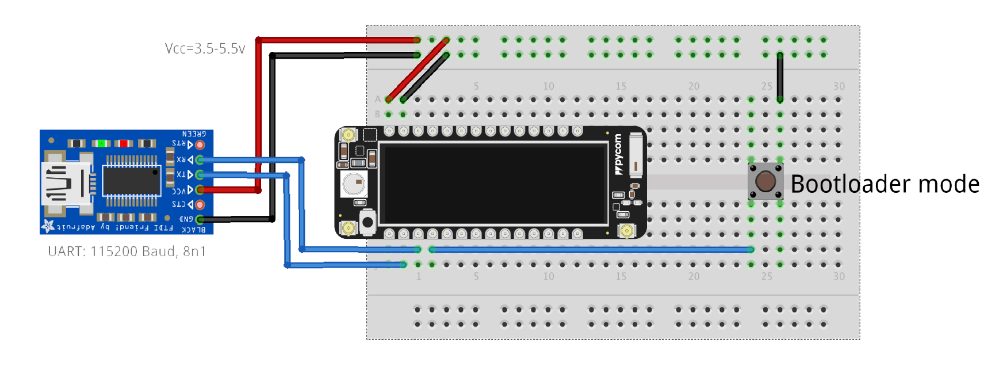
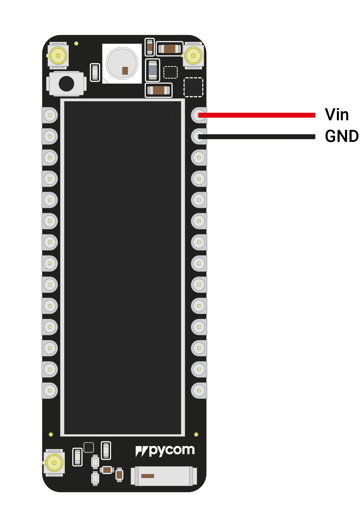
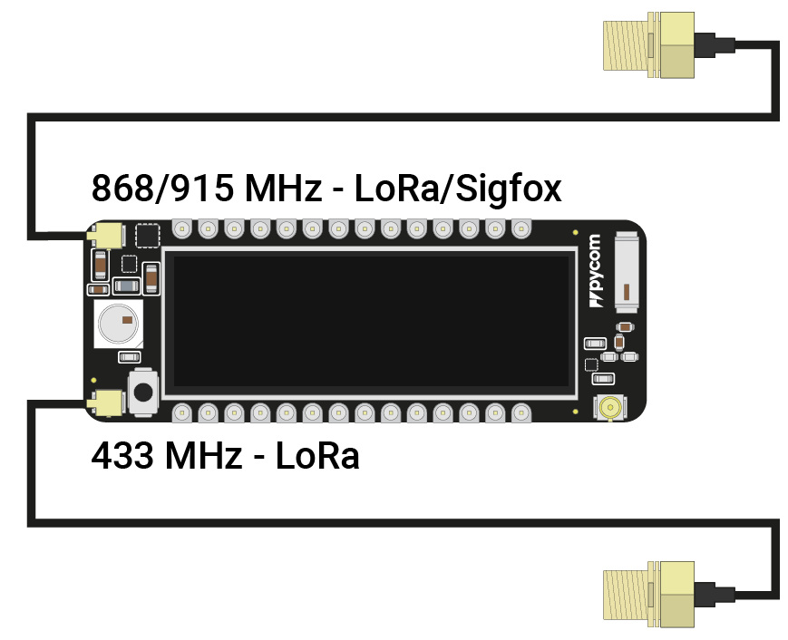
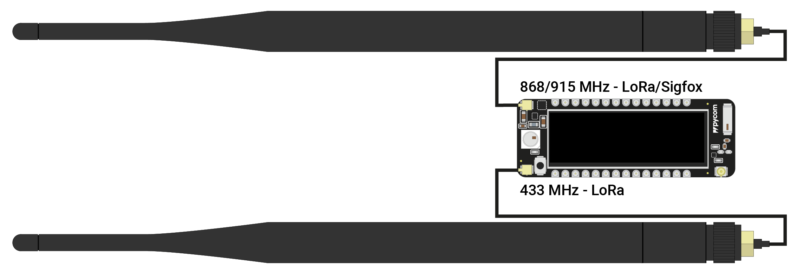
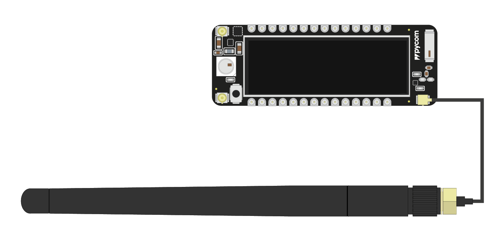

# LoPy 4

## Basic connection



* Look for the reset button on the module \(located at a corner of the board, next to the LED\).
* Locate the USB connector on the expansion board.
* Insert the LoPy4 module on the the expansion board with the reset button pointing towards the USB connector. It should firmly click into place and the pins should now no longer be visible.




* Before connecting your module to an Expansion Board 3.0, you should update the firmware on the Expansion Board 3.0. Instructions on how to do this can be found [here](../../pytrack-pysense-pyscan/installation/firmware.md).
* Look for the reset button on the module \(located at a corner of the board, next to the LED\).
* Locate the USB connector on the expansion board.
* Insert the LoPy4 module on the Expansion Board with the reset button pointing towards the USB connector. It should firmly click into place and the pins should now no longer be visible.




* Before connecting your module to a Pysense/Pytrack/Pyscan board, you should update the firmware on the Pysense/Pytrack/Pyscan. Instructions on how to do this can be found [here](../../pytrack-pysense-pyscan/installation/firmware.md).
* Look for the reset button on the LoPy4 module \(located at a corner of the board, next to the LED\).
* Locate the USB connector on the Pysense/Pytrack/Pyscan.
* Insert the module on the Pysense/Pytrack/Pyscan with the reset button pointing towards the USB connector. It should firmly click into place and the pins should now no longer be visible.




* Firstly you will need to connect power to your LoPy4. You will need to supply `3.5v`-`5.5v` to the `Vin` pin.


Do **not** feed `3.3v` directly to the `3.3v` supply pin, this will damage the regulator.


* The connect the `RX` and `TX` of your USB UART to the `TX` and `RX` of the LoPy4 respectively.


Please ensure you have the signal level of the UART adapter set to `3.3v` before connecting it.


* In order to put the LoPy4 into bootloader mode to update the device firmware you will need to connect `P2` to `GND`. We recommend you connect a button between the two to make this simpler.




**Note:** This method of connection is not recommended for first time users. It is possible to lock yourself out of the device, requiring a USB connection.

* In order to access the LoPy4 via WiFi you only need to provide `3.5v` - `5.5v` on the `Vin` pin of the LoPy4:

* By default, when the LoPy4 boots, it will create a WiFi access point with the following credentials:
  * SSID: `lopy4-wlan`
  * password: `www.pycom.io`
* Once connected to this network you will be able to access the telnet and FTP servers running on the LoPy4. For both of these the login details are:
  * username: `micro`
  * password: `python`



## Antennas

### Lora/Sigfox


If you intend on using the LoRa/Sigfox connectivity of the LoPy4 you **must** connect a LoRa/Sigfox antenna to your LoPy4 before trying to use LoRa/Sigfox otherwise you risk damaging the device.


* Firstly you will need to connect the U.FL to SMA pig tail to the LoPy4 using one of the two the U.FL connectors on the same side of the LoPy4 as the LED. The one on the left hand side is for 433MHz \(LoRa only\), the one of the right hand side is for 868MHz/915MHz \(LoRa & Sigfox\). **Note:** This is different from the LoPy.

* If you are using a pycase, you will next need to put the SMA connector through the antenna hole, ensuring you align the flat edge correctly, and screw down the connector using the provided nut.
* Finally you will need to screw on the antenna to the SMA connector.

### WiFi/Bluetooth \(optional\)

All Pycom modules, including the LoPy4, come with a on-board WiFi antenna as well as a U.FL connector for an external antenna. The external antenna is optional and only required if you need better performance or are mounting the LoPy4 in such a way that the WiFi signal is blocked. Switching between the antennas is done via software, instructions for this can be found [here.](https://docs.pycom.io/chapter/firmwareapi/pycom/network/wlan.html)

