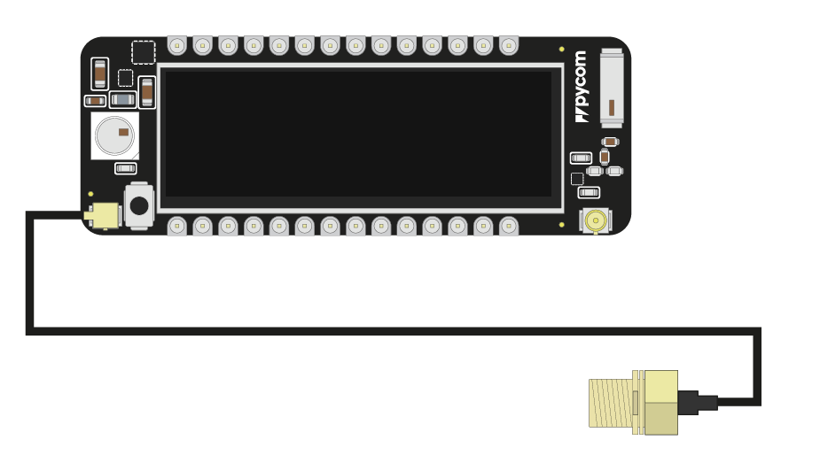
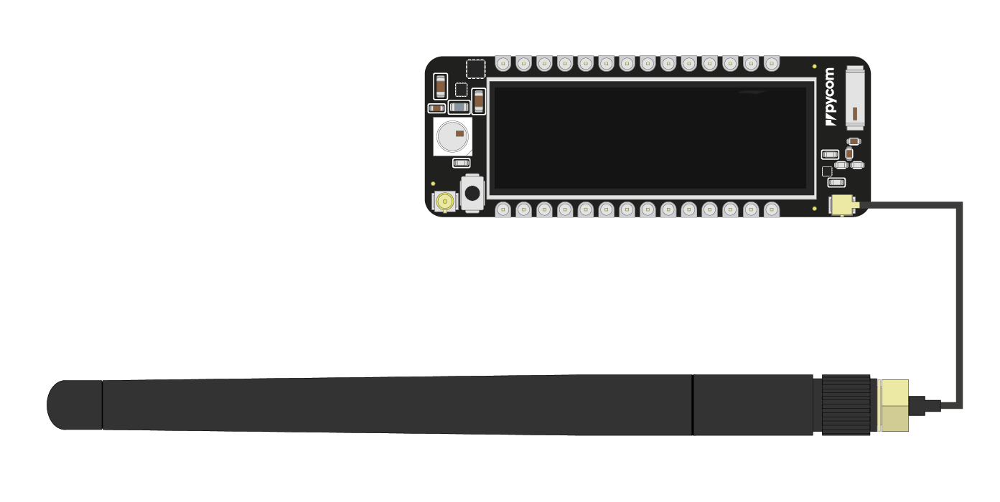

# LoPy

## Basic connection {#basic-connection}



* Look for the reset button on the module \(located at a corner of the board, next to the LED\).
* Locate the USB connector on the expansion board.
* Insert the LoPy module on the the expansion board with the reset button pointing towards the USB connector. It should firmly click into place and the pins should now no longer be visible.




* Before connecting your module to an Expansion Board 3.0, you should update the firmware on the Expansion Board 3.0. Instructions on how to do this can be found [here](../../pytrackpysense/installation/firmware.md).
* Look for the reset button on the module \(located at a corner of the board, next to the LED\).
* Locate the USB connector on the expansion board.
* Insert the LoPy module on the Expansion Board with the reset button pointing towards the USB connector. It should firmly click into place and the pins should now no longer be visible.




* Before connecting your module to a Pysense/Pytrack/Pyscan board, you should update the firmware on the Pysense/Pytrack/Pyscan. Instructions on how to do this can be found [here](../../pytrackpysense/installation/firmware.md).
* Look for the reset button on the LoPy module \(located at a corner of the board, next to the LED\).
* Locate the USB connector on the Pysense/Pytrack/Pyscan.
* Insert the module on the Pysense/Pytrack/Pyscan with the reset button pointing towards the USB connector. It should firmly click into place and the pins should now no longer be visible.




* Firstly you will need to connect power to your LoPy. You will need to supply `3.5v`-`5.5v` to the `Vin` pin.


Do **not** feed `3.3v` directly to the `3.3v` supply pin, this will damage the regulator.


* The connect the `RX` and `TX` of your USB UART to the `TX` and `RX` of the LoPy respectively.


Please ensure you have the signal level of the UART adapter set to `3.3v` before connecting it.


* In order to put the LoPy into bootloader mode to update the device firmware you will need to connect `P2` to `GND`. We recommend you connect a button between the two to make this simpler.




**Note:** This method of connection is not recommended for first time users. It is possible to lock yourself out of the device, requiring a USB connection.

* In order to access the LoPy via WiFi you only need to provide `3.5v` - `5.5v` on the `Vin` pin of the LoPy:

* By default, when the LoPy boots, it will create a WiFi access point with the following credentials:
  * SSID: `lopy-wlan`
  * password: `www.pycom.io`
* Once connected to this network you will be able to access the telnet and FTP servers running on the LoPy. For both of these the login details are:
  * username: `micro`
  * password: `python`



## Antennas

### Lora


If you intend on using the LoRa connectivity of the LoPy you **must** connect a LoRa antenna to your LoPy before trying to use LoRa otherwise you risk damaging the device.



The LoPy only supports LoRa on the 868MHz or 915MHz bands. It does not support 433MHz. For this you will require a LoPy4.


* Firstly you will need to connect the U.FL to SMA pig tail to the LoPy using the U.FL connector on the same side of the LoPy as the LED.

* If you are using a pycase, you will next need to put the SMA connector through the antenna hole, ensuring you align the flat edge correctly, and screw down the connector using the provided nut.
* Finally you will need to screw on the antenna to the SMA connector.

### WiFi/Bluetooth \(optional\)

All Pycom modules, including the LoPy, come with a on-board WiFi antenna as well as a U.FL connector for an external antenna. The external antenna is optional and only required if you need better performance or are mounting the LoPy in such a way that the WiFi signal is blocked. Switching between the antennas is done via software, instructions for this can be found [here.](../../firmwareapi/pycom/network/wlan.md)

## Deep Sleep current issue

The LoPy, SiPy, and WiPy 2.0 experience an issue where the modules maintain a high current consumption in deep sleep mode. This issue has been resolved in all newer products. The cause for this issue is the DC to DC switch mode converter remains in a high performance mode even when the device is in deep sleep. The flash memory chip also does not power down. A more detailed explanation can be found [here.](https://forum.pycom.io/topic/1022/root-causes-of-high-deep-sleep-current)

