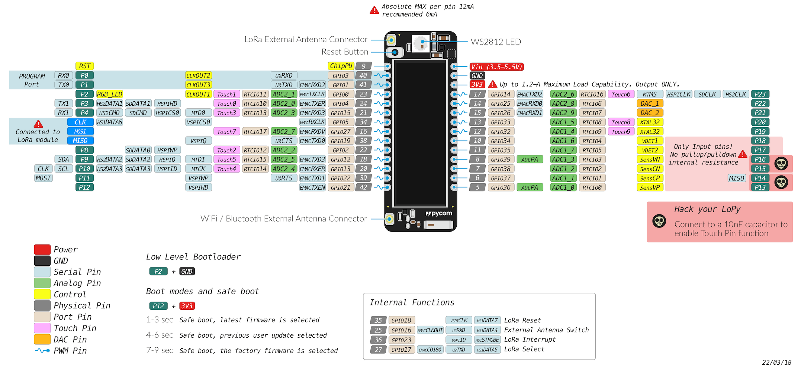

# 6.1.3 LoPy

**Store**: [Buy Here](http://www.pycom.io/lopy)

**Getting Started:** [Click Here](https://docs.pycom.io/chapter/gettingstarted/connection/lopy.html)

## Pinout

The pinout of the LoPy is available as a PDF File




Please note that the PIN assignments for UART1 \(TX1/RX1\), SPI \(CLK, MOSI, MISO\) and I2C \(SDA, SCL\) are defaults and can be changed in Software.


## Datasheet

The datasheet of the LoPy is available as a PDF File.



## Notes

### WiFi

By default, upon boot the LoPy will create a WiFi access point with the SSID `lopy-wlan-XXXX`, where `XXXX` is a random 4-digit number, and the password `www.pycom.io`.

### Power

The `Vin` pin on the LoPy can be supplied with a voltage ranging from `3.5v` to `5.5v`. The `3.3v` pin on the other hand is output **only**, and must not be used to feed power into the LoPy, otherwise the on-board regulator will be damaged.

### Deep Sleep

Due to a couple issues with the LoPy design the module draws more current than it should while in deep sleep. The DC-DC switching regulator always stays in high performance mode which is used to provide the lowest possible output ripple when the modules is in use. In this mode, it draws a quiescent current of 10mA. When the regulator is put into ECO mode, the quiescent current goes down to 10uA. Unfortunately, the pin used to control this mode is out of the RTC domain, and therefore not usable during deep sleep. This causes the regulator to always stay in PWM mode, keeping its quiescent current at 10mA. Alongside this the flash chip doesn't enter power down mode because the CS pin is floating during deep sleep. This causes the flash chip to consume around 2mA of current. To work around this issue a ["deep sleep shield"](../boards/deepsleep/) is available that attaches to the module and allows power to be cut off from the device. The device can then be re-enabled either on a timer or via pin interrupt. With the deep sleep shield the current consumption during deep sleep is between 7uA and 10uA depending on the wake sources configured.

## Tutorials

Tutorials on how to the LoPy module can be found in the [examples](../../tutorials-and-examples/introduction.md) section of this documentation. The following tutorials might be of specific interest for the LoPy:

* [WiFi connection](../../tutorials-and-examples/all/wlan.md)
* [LoRaWAN node](../../tutorials-and-examples/lora/lorawan-abp.md)
* [LoRaWAN nano gateway](../../tutorials-and-examples/lora/lorawan-nano-gateway.md)
* [BLE](../../tutorials-and-examples/all/ble.md)

