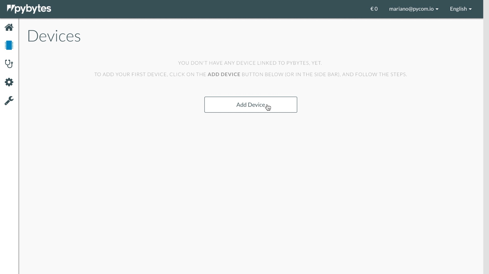
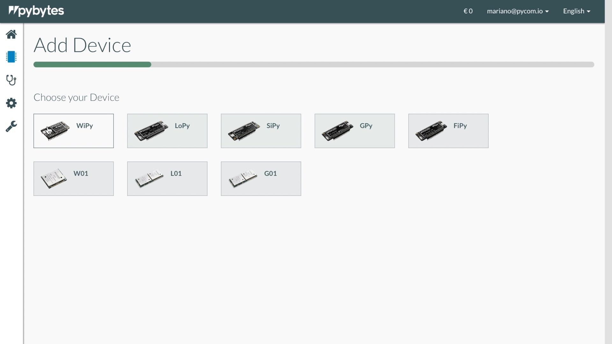
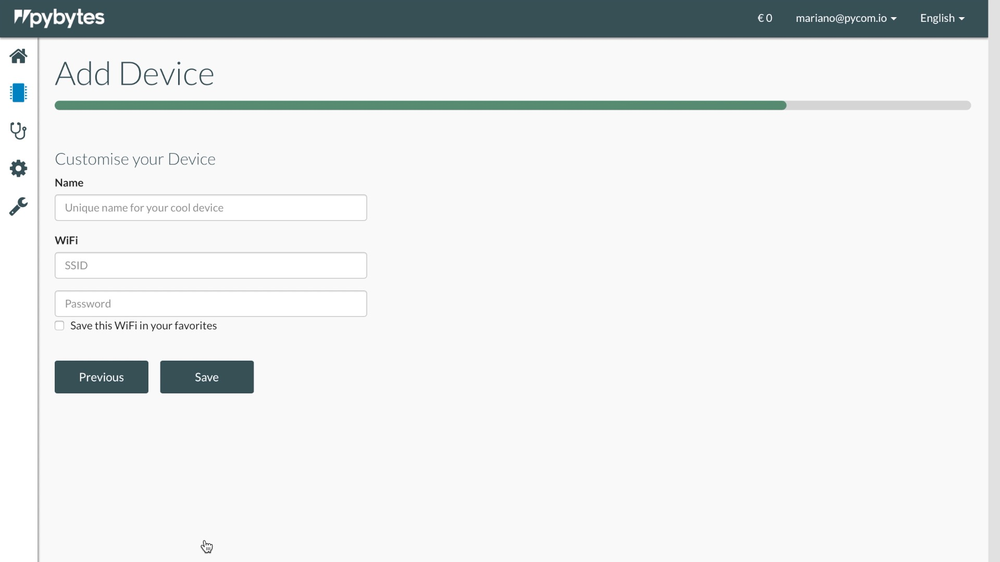

# Add a device to Pybytes

In this section, we will explain to you how to add a device to Pybytes

## Step 1: Add device wizard

In Pybytes, go to `Devices` Page:

1. Click on `Add Device`.

1. Select your device \(e.g., WiPy, LoPy, SiPy, etc.\);

1. Select your shield \(e.g., PySense, PyTrack, PyScan or other\);

1. Select your network option;

1. Enter a unique name and the network credentials \(SSID and password\) for your device;

## Step 2: Connect your device to Pybytes

At the end of the "Add Device" wizard, Pybytes will give you two options for you to connect your device to Pybytes:

Select how you would like to connect your device to Pybytes:

1. [Connect your device quickly \(Recommended\)](quick.md)



1. [Connect your device by flashing Pybytes Library](flash.md)




From firmware 1.16.x onwards all Pycom devices come with Pybytes library built-in `/frozen` folder. That means that you can choose between adding your device quickly with the firmware updater or you can flash Pybytes library manually.


