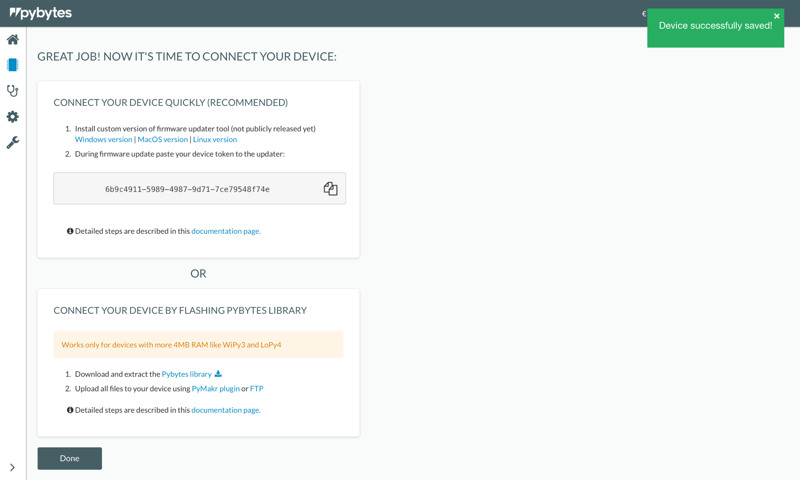
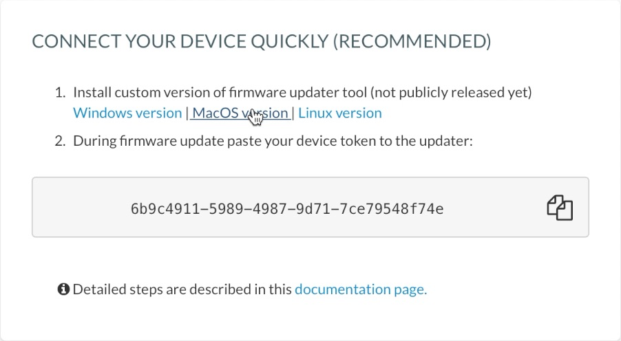
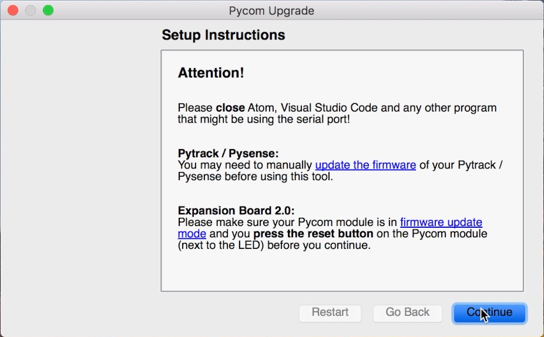
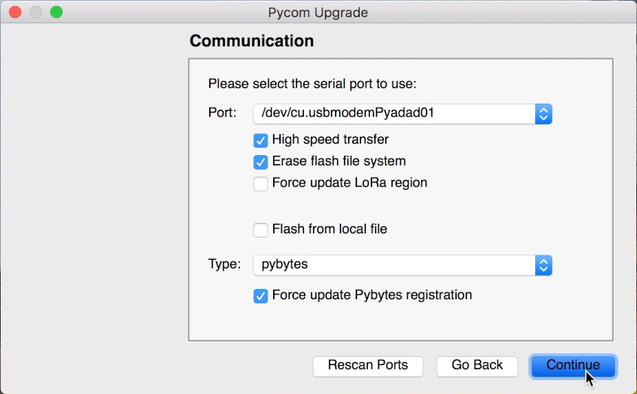
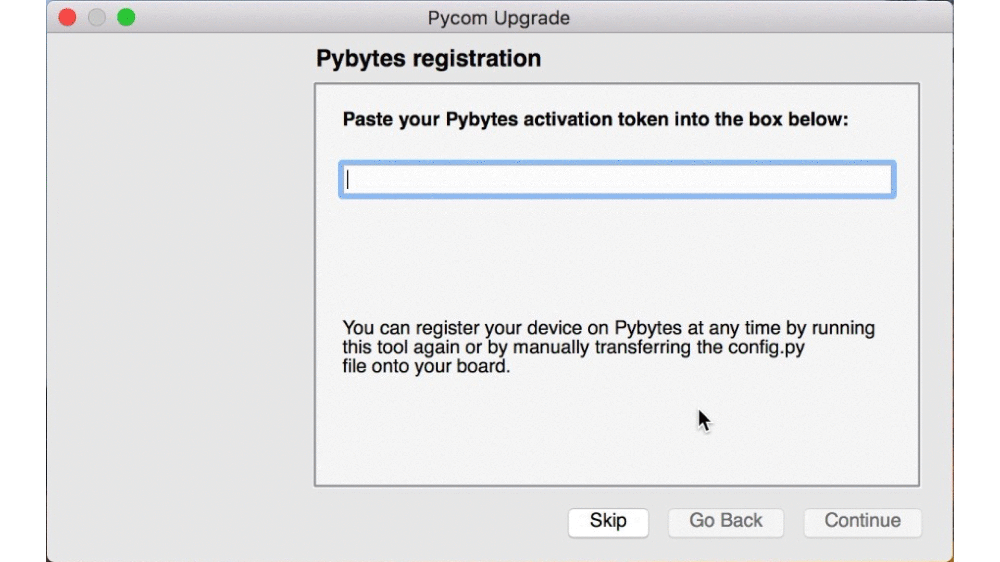

# Connect to Pybytes: Quick Add

## Connecting a device to Pybytes quickly by using the Firmware Updater

In this section, we explain to you how to connect your device to Pybytes quickly using the Firmware Updater.


In case you want to extend Pybytes library you can flash Pybytes library manually. [Click here for more information.](flash.md)


### Step 1: Download the firmware updater

At the last step of the "Add Device" process:

1. Download the [firmware updater](https://pycom.io/downloads/) for your operating system;

2. Copy the device token.

### Step 2: Firmware updater

Install the Firmware updater on your computer.

1. Start the `Firmware updater`;

2 .Select your device serial port \(Make sure your device is connected to your computer\);

3. Mark the options "Erase flash file system" and "Force update Pybytes registration";

4. Paste your device token from Pybytes;

5. The firmware updater will update the device's firmware.

## Next step: Set up your device's dashboard!

Now it's time to display data from your device into Pybytes dashboard.



