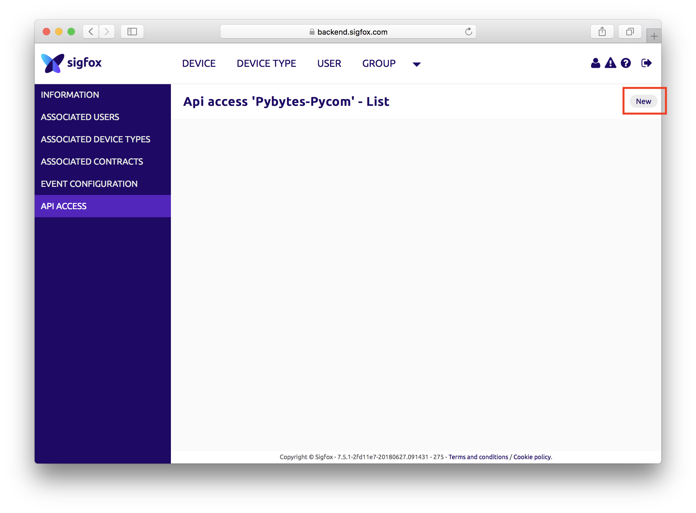
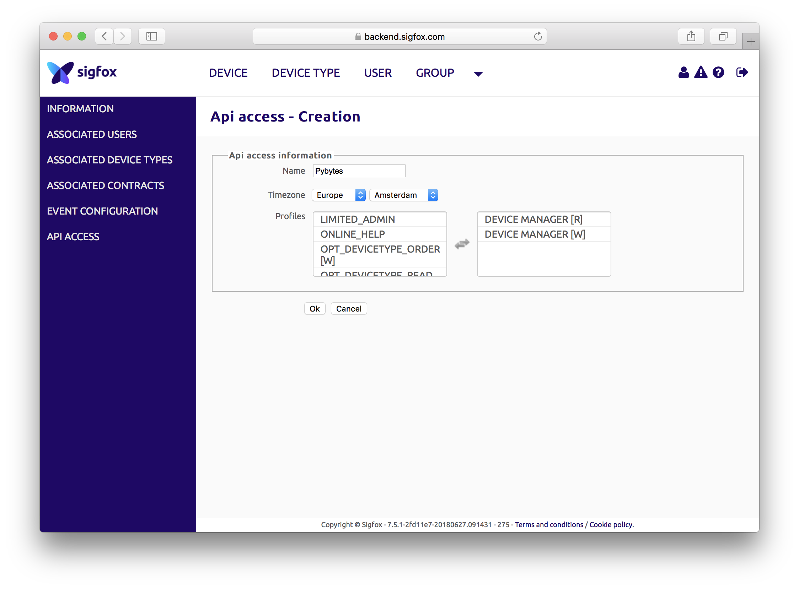
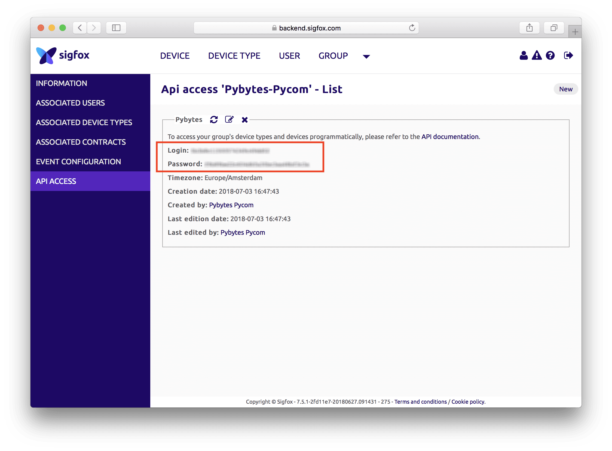
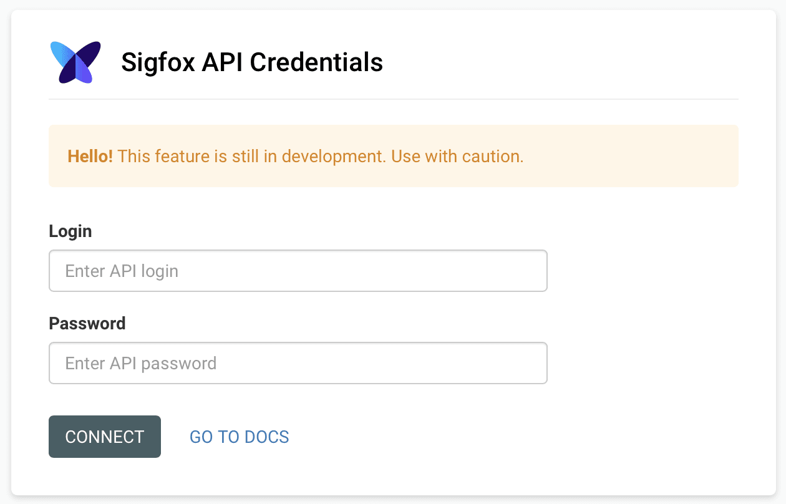

# 8.3.3 Add Sigfox device


Before you start you need to create Sigfox account. You need Pycom device with Sigfox to get your Sigfox account. [**Follow these instructions**](../../../getting-started/registration/sigfox.md).


## Create Sigfox API credentials

Once you have you account setup and are logged in Sigfox backend, you need to create API credentials for Pybytes.

Click on GROUP → &lt;your\_company\_name&gt; → API ACCESS → New

In the form chose arbitrary _name_, select Profiles `DEVICE MANAGER [R]` and `DEVICE MANAGER [W]`. Then click on Ok.

Copy _Login_ and _Password_ to the clipboard.

In Pybytes go to Settings → Sigfox API or [follow this link](https://pybytes.pycom.io/settings/sigfox-credentials) then paste in the form.

## Sigfox contract types

### Sigfox DevKit contracts

Read more how to use Sigfox with [devKit contract](devkit.md).



### Sigfox custom contracts

Read more how to use Sigfox with [Custom contract](devkit.md).



