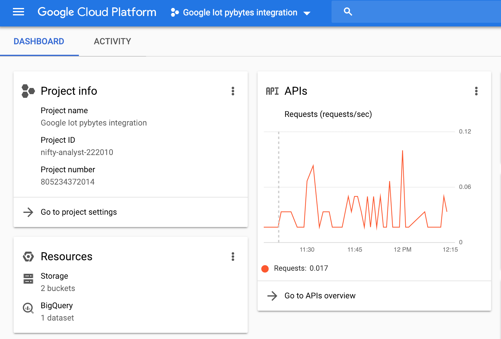
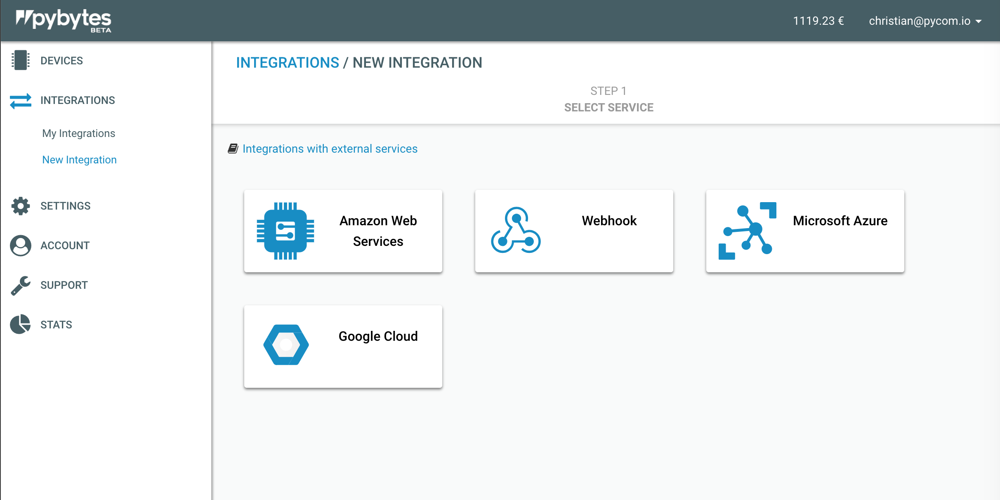
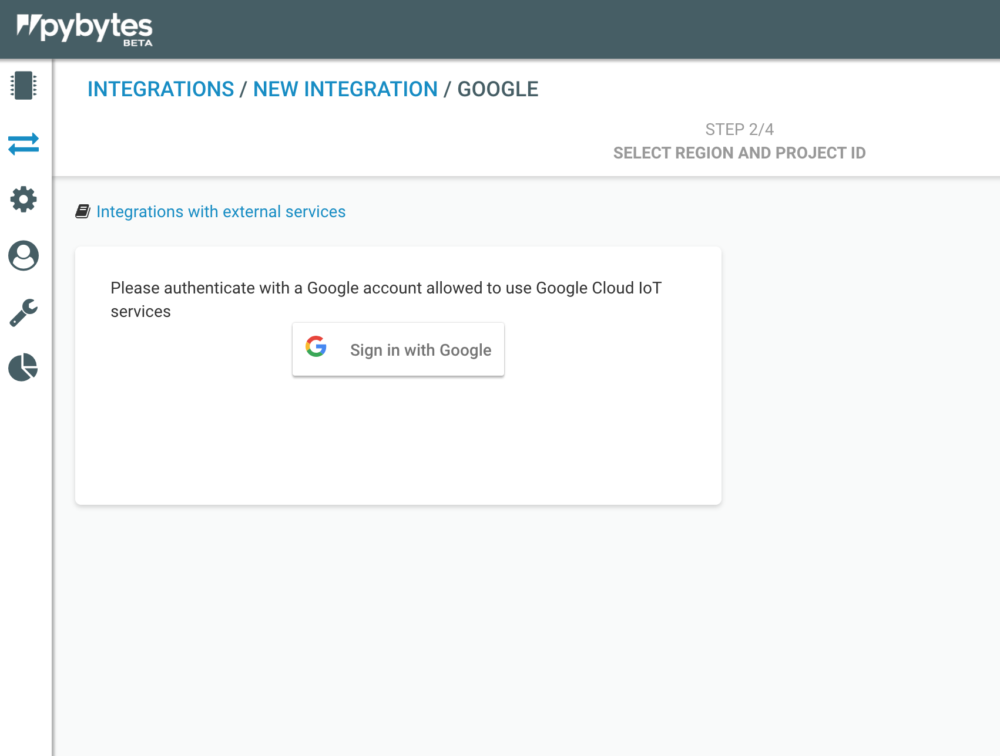
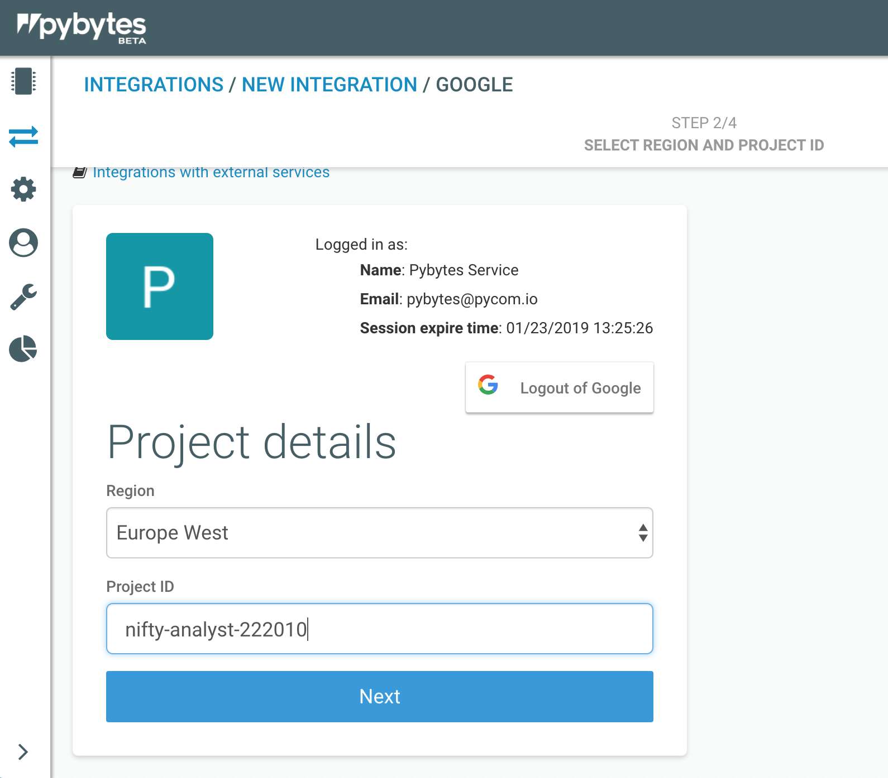
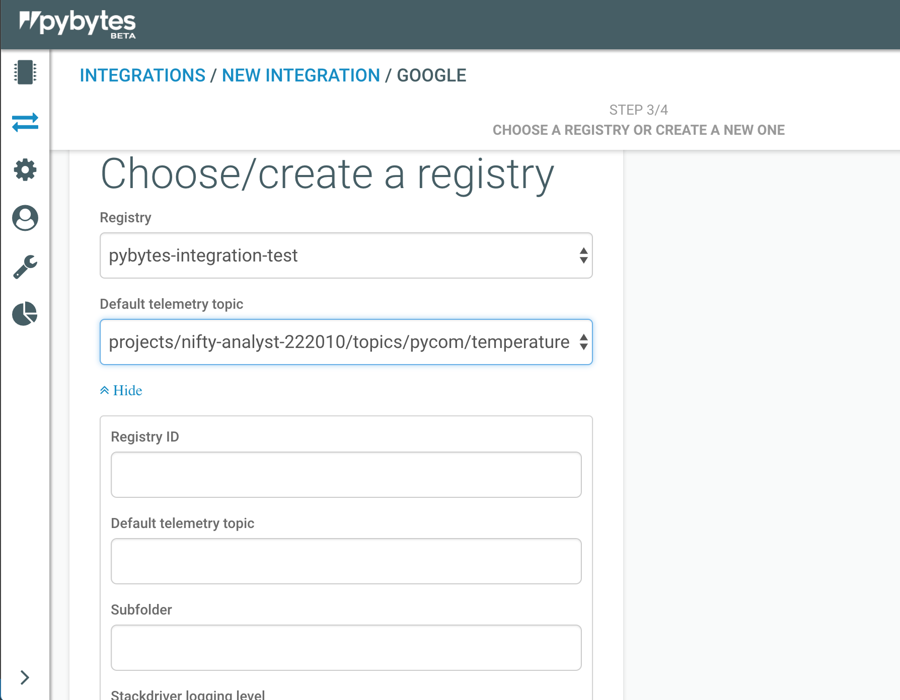
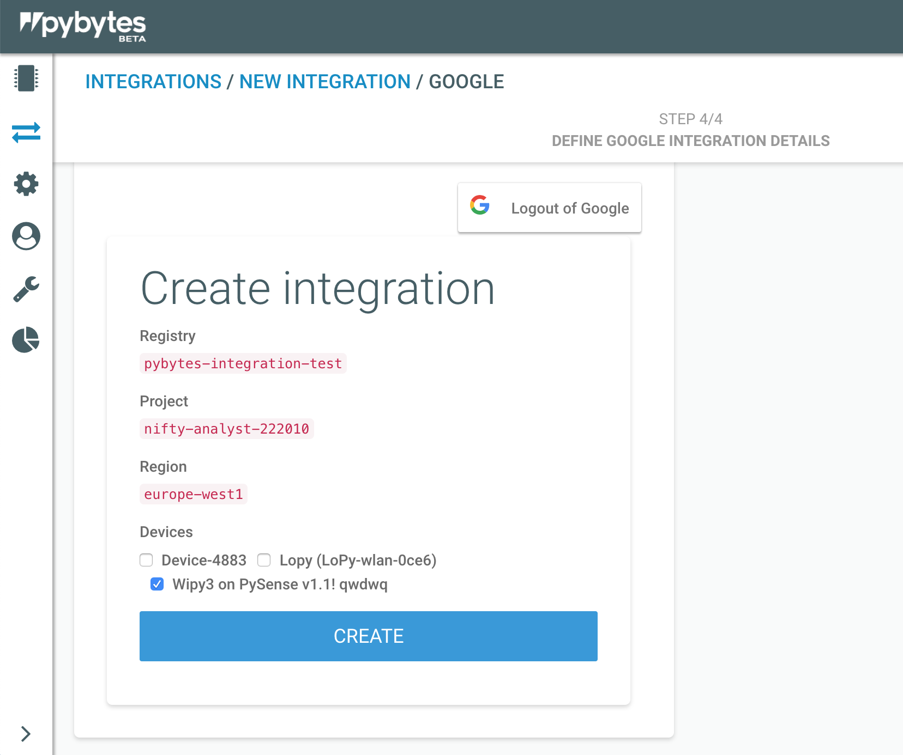
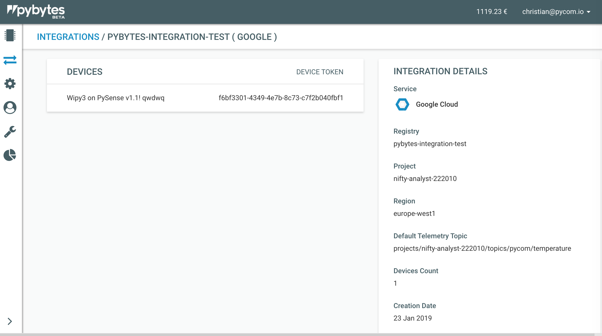
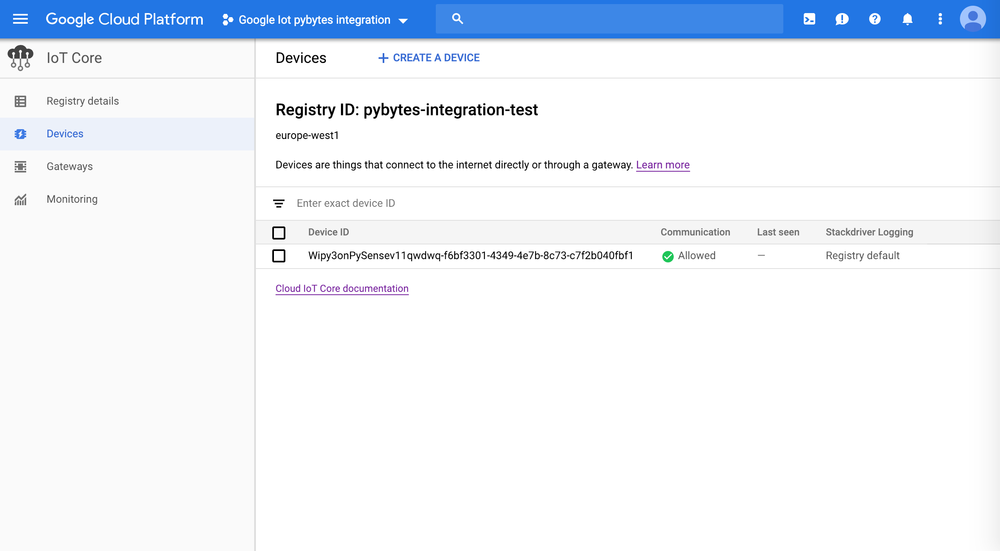

# Google Cloud IoT

Whenever one of your integrated devices sends a signal to our broker, we republish the binary payload to the Google endpoint specified for its integration through MQTT protocol.

## Integrate your devices

1. First of all, you have to create a Google project or select an existing one inside [Google console](https://console.cloud.google.com/cloud-resource-manager) ([read also here for further information](https://cloud.google.com/resource-manager/docs/creating-managing-projects)). Take note of the Project ID, which it will be used for integrating your devices.
2. Make sure to [enable billing](https://cloud.google.com/billing/docs/how-to/modify-project) and [the Cloud IoT Core API](https://console.cloud.google.com/flows/enableapi?apiid=cloudiot.googleapis.com&redirect=https://console.cloud.google.com&_ga=2.236270149.-51976751.1517992223) for that project.
3. At this point, you should see inside your Google IoT dashboard that your project is correctly bound to Google IoT services

4. Now let's access Pybytes and click _Integrations > New integration > Google Cloud_

5. You'll see that Pybytes requires you to authenticate with your Google account. The account you'll be using, must have the privileges to access that project.

6. Once you've logged in, the first thing to do is to specify the project's ID and the region. This is required to correctly identify a resource and list all the related [registries](https://cloud.google.com/iot/docs/concepts/devices#device_registries).

7. The following step allows you to create a new registry or select an existing one. Whenever you choose a registry, the corresponding topics will be loaded in the dropdown menu below. This is required by Google, but it's different from the topics used by the integration to publish payloads to Google cloud.

8. The last step allows you to choose the devices you want to integrate and summarizes the identifying elements of this integration.

9. Once you click _Create_, if the operation is successful, you'll be able to see the final screen which states the correct integration.

If you access the registry on Google cloud, you'll be able to see the just created device there as well.

## Final considerations

We create an [ES256 key with a self-signed X.509 certificate](https://cloud.google.com/iot/docs/how-tos/credentials/keys#generating_an_es256_key_with_a_self-signed_x509_certificate) for every device. The private key will be used for authenticating the device with the Google's broker.
You could access the [StackDriver application](https://app.google.stackdriver.com) to see the events, according to the log level you chosed for a device. In case you haven't chosen one, it will inherit the level of the registry it belongs.

**Warning**: do not delete Google devices directly from Google cloud user interface, otherwise the integration with Pybytes will stop working. Always use Pybytes interface to delete Google devices.