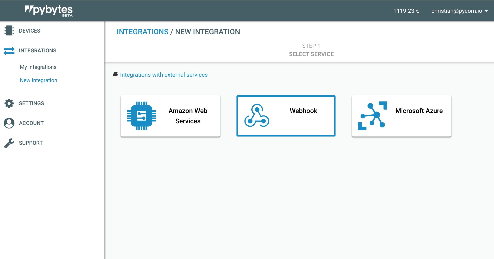
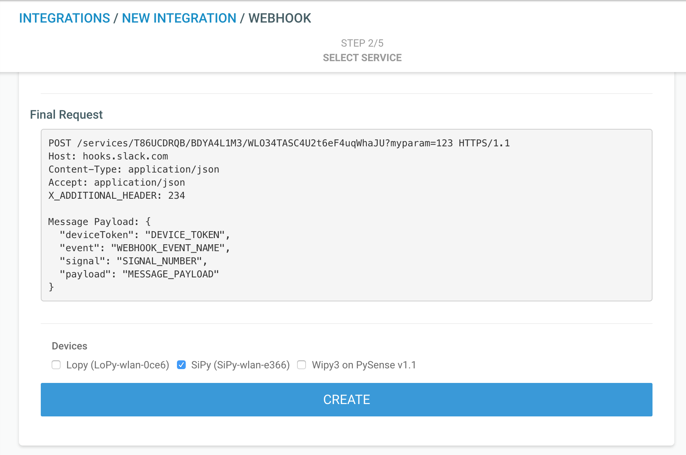
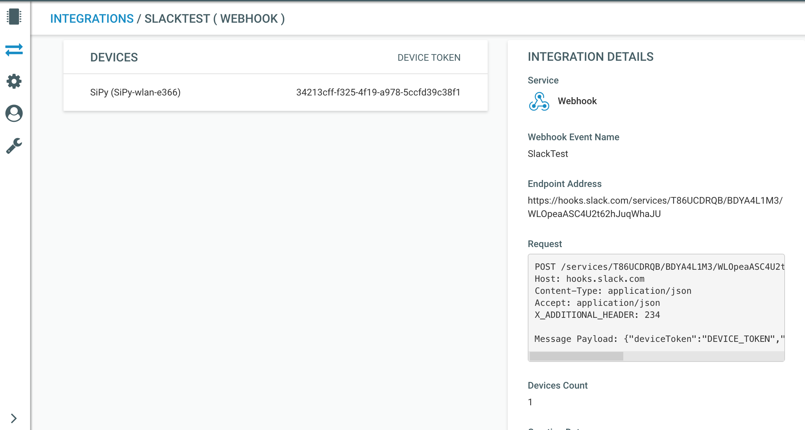

# Web hooks

Whenever one of your integrated devices sends a signal to our broker, we perform an HTTP request defined by the user. You can use some presets (`DEVICE_TOKEN`, `USER_ID`, etc), which will act like placeholders and will be dinamically replaced at the moment of performing the request with the relative content.

## Integrate your devices

1. Go in the sidebar, click on _New Integration_ and then on _Webhook_

2. Fill in the form specifying the following information:
    1. The remote URL to which we will send the data
    2. An event name
    3. The HTTP method
    4. The request format. Please note that we will prefill some headers whenever you change the format. The prefilled headers are not modifiable.
    5. You can optionally add some more headers and query parameters. There's also an eased interface for basci HTTP auth.
    6. We will take care of formatting the body accordingly to the chosen request format. In case you've chosen _Custom Body_, you'll have to define everything by yourself and you'll also be allowed to manually insert the presets.

Once you're done, you'll see a preview of the request at the bottom of the page. Remember to choose the devices you want to bind to this service.

3.  If everything's worked as expected, you should be able to see a summary of your integration like the following:

